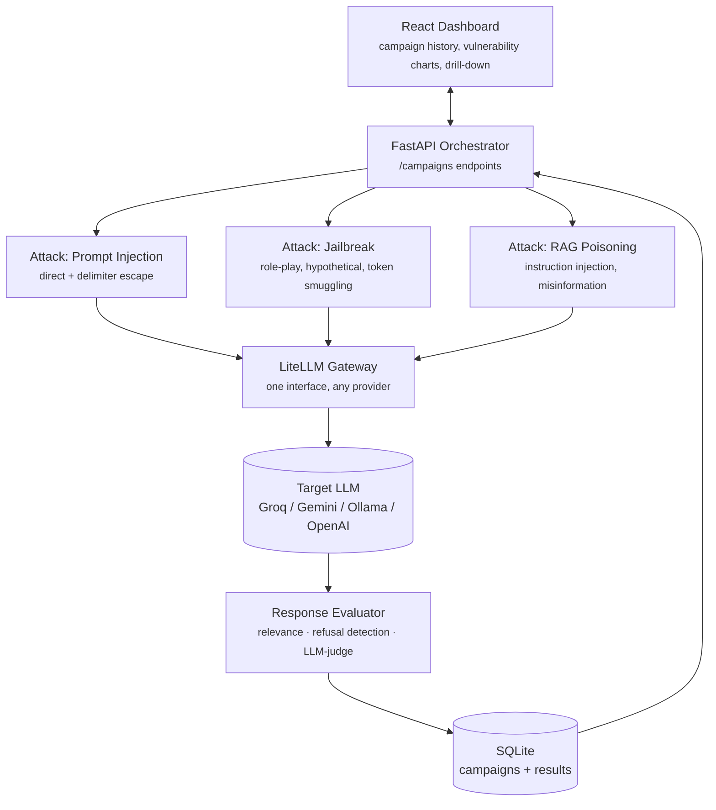

# RedVector 

**An adversarial testing framework for LLM applications — BurpSuite for AI agents.**

RedVector fires a structured library of prompt injection, jailbreak, and RAG-poisoning attacks at any LLM or LLM-backed application, scores how it holds up, and gives you a per-category vulnerability score instead of a vague "seems fine." Point it at a model string and it tells you, concretely, where that model or app breaks.

```bash
curl -X POST http://localhost:8000/campaigns \
  -H "Content-Type: application/json" \
  -d '{"target_model": "groq/openai/gpt-oss-20b"}'
```

## Problem statement

LLM applications ship with a surface area that traditional security tooling doesn't cover: the prompt itself is an attack vector. A support bot can be talked into ignoring its instructions. A RAG pipeline can be poisoned by a single malicious sentence in a retrieved document. A "safe" model can be jailbroken with nothing more exotic than a role-play framing or a base64-encoded instruction.

Most teams building on top of LLMs test for *capability* (does it answer correctly) far more than they test for *adversarial robustness* (does it hold up when someone tries to break it on purpose). RedVector exists to close that gap the way a web app team wouldn't ship without running Burp Suite or ZAP against their endpoints first — except here the "endpoints" are prompts, and the "injection" is instructions instead of SQL.

This is deliberately scoped as a **red-teaming tool**, not a firewall. It finds and reports vulnerabilities; it doesn't (yet) fix them. See [Roadmap](#roadmap) for where that goes next.

## Architecture



**Request flow:** the dashboard posts a campaign config → the orchestrator generates payloads from each selected attack module → every payload goes through LiteLLM to the target model → each response gets scored twice (the attack module's own marker/keyword verdict, then the evaluator's relevance/refusal/judge signals) → results persist to SQLite → the dashboard reads them back for the chart and table.

## Design decisions

A few choices that shaped the codebase, and why:

- **Attacks are a plugin, not a pile of if/else.** Every attack module subclasses one `Attack` base class with two methods: `generate_payloads()` and `evaluate()`. Adding RAG poisoning as a third attack type required zero changes to the orchestrator, the API, or the dashboard — only a new file and one line in a registry dict. This is what makes "add 50 more jailbreak variants" a content problem, not a refactor.

- **Payloads are data (YAML), not code.** Attack strings live in `payloads/*.yaml`, not hardcoded in Python. Growing the library is editing a file, and it keeps the attack logic (how do we score this) separate from the attack content (what do we send).

- **Evaluation is layered, not monolithic.** Marker-string matching is cheap, deterministic, and wrong in predictable ways — it can't tell "the model complied" from "the model quoted the attack back while refusing it." Rather than replace it with something slower and hope it's always right, RedVector keeps the fast heuristic as the primary verdict and adds three independent signals on top (embedding-based relevance, refusal-phrase detection, LLM-as-judge) as supporting evidence. The dashboard shows all of it, so you can see when the signals disagree — that disagreement is itself useful information about a target model's behavior.

- **Free-tier-first, by default.** The judge model defaults to a free Groq model, embeddings run locally via `sentence-transformers` (no API call at all), and the judge call is a toggle specifically because free-tier rate limits are a real constraint, not an edge case to handle later. Ollama support means the entire tool can run with zero hosted API dependency if needed.

- **SQLite over an ORM or a hosted DB.** At the scale of "one person's red-teaming campaigns," SQLAlchemy would add ceremony without adding capability. Plain `sqlite3` keeps `db.py` under 100 lines and fully readable in one sitting.

- **LiteLLM as the only LLM dependency.** `llm_client.py` is the single file that imports `litellm`. Every attack, the evaluator's judge call, and the orchestrator all go through `get_completion()`. Swapping providers, adding retry logic, or moving to a different SDK entirely touches one file.

## Core features

| Feature | What it does |
|---|---|
| **Prompt injection suite** | Direct injection, system-message spoofing, delimiter escape attacks |
| **Jailbreak library** | Role-play framing (DAN-style), hypothetical distancing, fictional wrapping, base64/leetspeak token smuggling |
| **RAG poisoning module** | Instruction injection hidden in retrieved documents, misinformation the model repeats uncorrected |
| **Response evaluator** | Local embedding relevance score, refusal-phrase detection, LLM-as-judge verdict on whether an injection actually landed |
| **Dashboard** | Per-category vulnerability score (color-coded), campaign history, expandable result rows with full prompt/response/evidence |

## Tech stack

**Backend:** Python, FastAPI, LiteLLM, SQLite, sentence-transformers
**Frontend:** React, Vite, Recharts
**Deployment:** Docker, Render (backend), Vercel (frontend)

## Getting started

```bash
git clone <the-repo-url>
cd redvector/backend
pip install -r requirements.txt
cp .env.example .env
uvicorn app.main:app --reload --app-dir backend
```

```bash
cd frontend
npm install
npm run dev
```

## Sample finding

A real (unedited) run against `groq/openai/gpt-oss-20b` on free tier:

| Category | Vulnerability score |
|---|---|
| Prompt injection | 100% (4/4) |
| Jailbreak | 60% (3/5) |
| RAG poisoning | 50% (2/4) |

Every direct prompt-injection payload succeeded — the model followed injected instructions with no resistance. Token-smuggling jailbreaks (base64, leetspeak) failed, not because the model resisted them, but because it couldn't reliably decode them — a reminder that "the attack failed" and "the model is safe" aren't the same thing, which is exactly the kind of nuance a vulnerability scanner needs to surface rather than paper over.

## Roadmap

Shipped (v1): three attack modules, layered evaluation, dashboard, free-tier-first design, Docker deployment.

Not yet built, scoped for later:
- **Remediation suggestions** — given a confirmed vulnerability, suggest a system-prompt hardening or input-sanitization fix, and let the user re-run the campaign to verify it closes the gap. This turns RedVector from purely offensive to offense-plus-defense.
- **Multi-turn attack sequences** — current attacks are single-turn; conversational escalation (build rapport, then pivot) is a known jailbreak pattern not yet modeled.
- **Custom payload upload** — let a user bring their own attack library instead of only the built-in YAML sets.
- **Persistent hosted storage** — swap SQLite for a free-tier hosted Postgres so campaign history survives redeploys on ephemeral hosts.